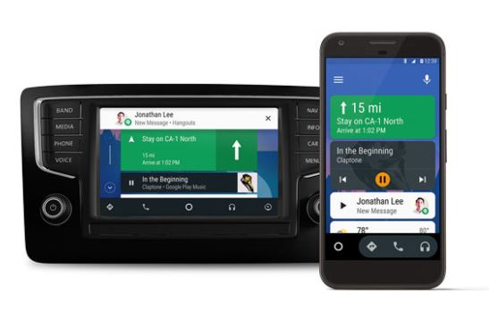
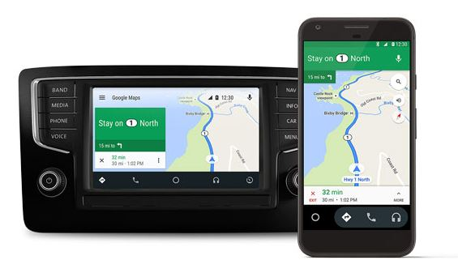
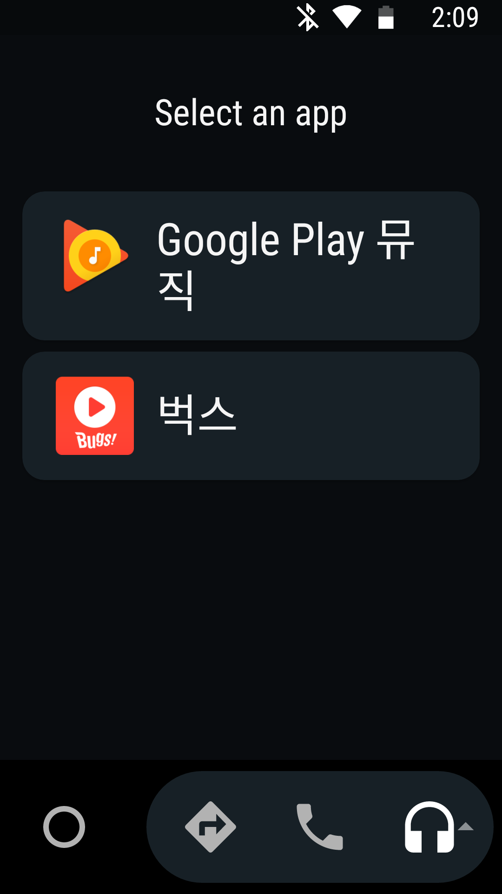
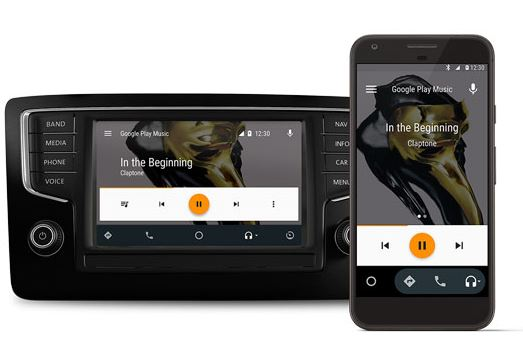
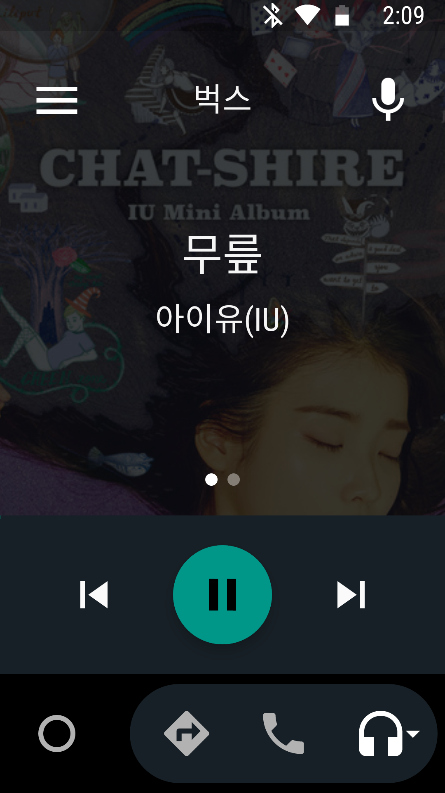
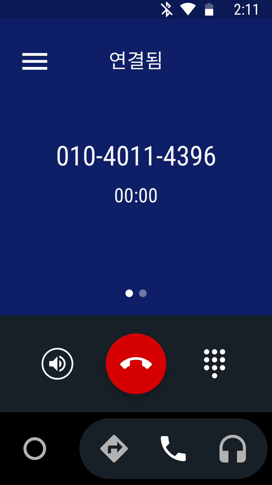
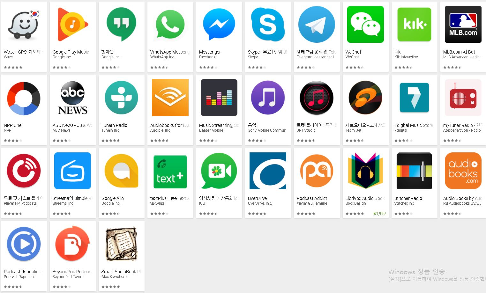

# Android Auto
Android Auto 에 대한 자료 조사 정리한것을 올립니다.

공식 사이트: [https://www.android.com/auto/](https://www.android.com/auto/)

Play Store App 링크: [Android Auto App](https://play.google.com/store/apps/details?id=com.google.android.projection.gearhead&utm_source=adc)

(참고, 한국에서는 지원하지 않음.)

20170904 기준 최신버전 v2.5.728603-release

datas 폴더 내 apk 파일 첨부. (파일명: Android Auto Maps Media Messaging Voice_v2.5.728603-release_apkpure.com.apk)

## 기능

(영상)

### 하나의 App, 두 가지 사용법

- 휴대폰에서 실행
- USB 잭으로 차에 연결해서 차 화면으로 실행

차에서 휴대폰을 더 편하게 쓸 수 있다.

### Home

각종 정보들 표시

### Maps

Google Maps 기반 네비게이션 실행.

### Music

휴대폰 내의 어플에서 음악 어플 선택 가능

구글 뮤직플레이.

벅스를 통해 음악 플레이.

### Call

통화기능.

### 추가 App들 지원

지원 App 목록: [g.co/androidauto](http://g.co/androidauto)

