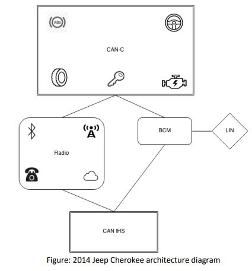
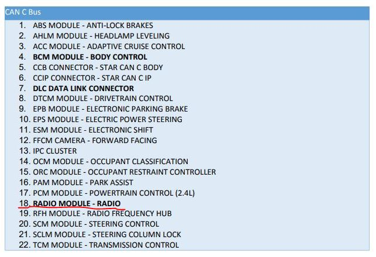
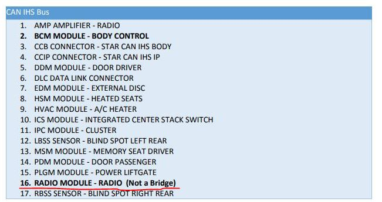

# Remote Exploitation of an Unaltered Passenger Vehicle

[Remote Exploitation of an Unaltered Passenger Vehicle.pdf](http://illmatics.com/Remote%20Car%20Hacking.pdf)

by Dr. Charlie Miller, Chris Valasek

## Intro

자동차 보안 연구는 2010년 CAN 버스에 메시지를 주입 할 수 있으면 차에 물리적인 변화를 줄 수 있다고 발표한 것에서 시작되었다.[[1]](http://www.autosec.org/pubs/cars-oakland2010.pdf) 그러나, 당시에는 공격자가 물리적인 접촉 없이 CAN 버스에 메시지를 주입할 방법이 없었기 때문에, 많은 비난을 받았다.

그리고 바로 다음 해에 라디오의 mp3 parser, 블루투스, 그리고 텔레매틱스 의 3 가지 다른 방법을 통해 RCE(Remote Code Excution)를 수행하여 CAN 버스에 메시지를 주입 하는데에 성공하였다. [[2]](http://www.autosec.org/pubs/cars-usenixsec2011.pdf)

2012년 DARPA의 지원을 받아 자동차 연구를 지속하고 새로운 연구자의 진입 장벽을 낮추기 위한 도구 라이브러리를 만들어 발표했다. [[3]](http://illmatics.com/content.zip)

해당 연구에서는 이전의 연구를 바탕으로 CAN 버스에 메시지를 주입 할 수 있다고 가정했으며, 다른 연구자들을 위해 정확한 메시지와 문서를 함께 공개했다. 또한 해당 연구의 또다른 중요한 성과는 CAN 메세지를 통해 차량 제어 장치(steering)를 제어 할 수 있는 방법을 입증한 것이다. 이것은 차량이 발전함에 따라 자동 주차 장치나 차선 유지 장치 같은 기능이 추가되었으며 이를 위해 ECU(Engine control unit)가 CAN bus로부터 명령어를 받아 처리해야 하기 때문에 가능해졌다.

하지만 또다시 업계에서는 해당 공격이 자동차에 물리적인 접근이 이루어져야 가능한 공격이라는것을 지적하였다.

따라서 이 문서에서는 2014 Jeep Cherokee를 타겟으로 하여 원격 공격을 통해 일부 기능을 물리적으로 제어하는 연구에 대하여 소개한다.

## Target: 2014 Jeep Cherokee

[차종별 Remote Attack Surface 분석 자료](http://illmatics.com/remote%20attack%20surfaces.pdf)

위의 자료에서 지적했듯이, Jeep Cherokee는 공격자가 공격을 수행함에 있어서 장애 가능성이 적어 보였다.

### Network Architecture

2014 Jeep Cherokee의 architecture는 head unit(Radio)이 차량에 구현된 두 개의 CAN bus 모두에 연결되어 있다.



따라서, 라디오가 침해된다면(compromised), ECU에 CAN-IHS와 CAN-C 네트워크 둘 모두를 통해 접근 할 수 있을것이라고 생각했다. 이것은 공격자의 메시지가 모든 ECU들에 전달 될 수 있음을 의미하며, 차량의 물리 제어가 가능함을 의미한다.

이 문서의 후반을 보면, head unit의 침해(compromise)는 약간의 추가적인 exploit stage들을 거쳐 CAN 버스들에 접근으로 이루어진다.

즉, 차량 제어장치(steering)와 같은 물리적으로 분리된 버스에도 접근이 가능하다.





### Cyber Physical Features

2014 Jeep Cherokee에서 사용된 운전 보조 시스템. 이것은 운전자와 주변사람들에 있어서 더 안전하게 해주는 요소 일 수 있지만, 공격자에게 있어서는 2012년의 연구에서처럼 CAN 버스를 통한 차량 물리 제어의 여지가 된다.

- **Adaptive Cruise Control (ACC)**

    - 차량간 적정 거리 유지를 도와주는 시스템.

    - 예를들어 앞 차가 감속을 하면 함께 감속을 시켜주고, 멈추면 함께 멈춰주고, 장애물이 사라지면 원래의 속도로 복구시켜주는 기능을 가지고 있다. 

- **Forward Collision Warning Plus (FCW+)**

    - ACC랑 비슷한 역할을 수행하는데, ACC와는 다르게 일부러 끄지 않는이상 항상 켜져있다.

- **Lane Departure Warning (LDW+)**

    - LDW+는 켜져있으면 차선을 유지할 수 있도록 도와준다.

    - 차선을 벗어나는것을 감지하면 바퀴를 제어해서 원래 차선을 유지하도록 한다.

- **Park Assist System (PAM)**

    - 주차 도움 시스템.

    - 이 기능이 steering을 제어하기 위한 가장 쉬운 entry point가 될 것이라고 생각했으며 2012년의 연구를 통해 CAN 메세지만으로 자동차를 제어 할 수 있음을 증명했다.

### Remote Attack Surface

| Entry Point     | ECU   | BUS            |
|-----------------|-------|----------------|
| RKE             | RFHM  | CAN C          |
| TPMS            | RFHM  | CAN C          |
| Bluetooth       | Radio | CAN C, CAN IHS |
| FM/AM/XM        | Radio | CAN C, CAN IHS |
| Cellular        | Radio | CAN C, CAN IHS |
| Internet / Apps | Radio | CAN C, CAN IHS |

위의 항목들 뿐 아니라 모든 외부와 상호작용하는 기술을 잠재적 Entry Point로 여겨야 한다.

- Passive Anti-Theft System (PATS)

    - 전송 받은 데이터는 id code와 RF 신호밖에 없었기 때문에 취약점을 찾지 못했다.

    - 게다가 취약점이 있다고 하더라도 센서에 근접해야만 하도록 설계되어있었다.

- Tire Pressure Monitoring System (TPMS)

    - 각각의 타이어가 압력 센서를 가지고 있으며 실시간으로 ECU에 데이터를 보낸다.

    - Jeep 에서 센서는 RFHM(Radio Frequency Hub Module) 과 연결되어있다.

    - 타이어에 문제가 생기거나 TPMS 시스템에 문제가 생겼다고 생각하게하여 TPMS가 어떤 행위를 수행하도록 하는 연구는 진행된 바가 있다. 
     
    - 해당 연구에서 연결된 ECU를 crash 시키거나, 원격으로 벽돌만들기를 할 수 있음을 보였다.

    - 코드 실행 가능성 측면에서는 매우 작은 attack surface지만, 원격으로 벽돌을 만든 사례는 데이터가 안전하지 않은 방식으로 처리됨을 의미한다.

- Remote Keyless Entry/Start (RKE)

    - 차량의 ECU와 통신하는 단거리 무선 송신기가 포함되어 있다.

    - Jeep 에서는 RFHM이 해당 정보를 받는다.

    - 암호화 되어있기 때문에 이를 이용하여 공격하는 것은 거의 불가능하고 제한적이다.

- Bluetooth
    + Jeep에서는 블루투스가 Radio(head unit)에 의해 수신되고 처리된다.
    + 이를 통해 주소록 엑세스, 전화걸기, 음악 스트리밍, SMS 등을 사용 할 수 있다.
    + 블루투스는 중요한 attack surface이다.

- Radio Data System

- Wi-Fi

- Telematics/Internet/Apps

```
일단 생략
```

## Uconnect System

### QNX Environment

### File System and Services

- IFS

- ETFS

- MMC

- PPS

### Wi-Fi

- Encryption

- Open ports

### D-Bus Services

### Cellular

### CAN Connectivity

## Jailbreaking Uconnect

### Any Version

### Version 14_05_03

### Update Mode

### Normal Mode

## Exploiting the D-Bus Service

### Gaining Code Execution

## Uconnect attack payloads

### GPS

### HVAC

### Radio Volume

### Bass

### Radio Station (FM)

### Display

- Change display to Picture

### Knobs
